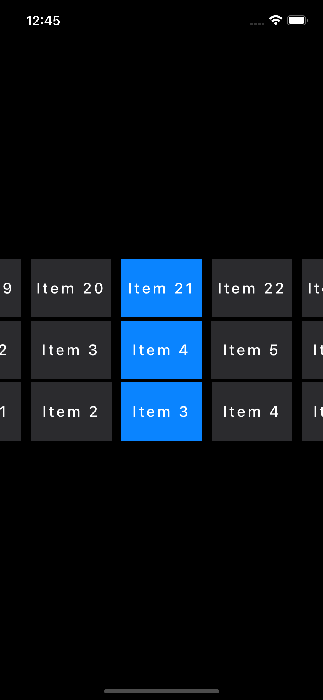

# Horizontal Picker View

Customizable horizontal picker view component written in Swift for UIKit/iOS.

- Flexible dataSource and delegates
- Minimal and functional
- Performant and testable
- Extensible and configurable

Usage
```swift
// Creation
let picker = HorizontalPickerView()
picker.datasource = self
picker.delegate = self

// Provide data

/// Number of rows to render
/// - Returns: Row count
func numberOfRows() -> Int

/// Number of items to render in each row
/// - Returns: Item count
func numberOfItems(in picker: HorizontalPickerView, for row: Int) -> Int

/// Attributed title to render in a given item at `IndexPath`
/// - Returns: Attributed String
func horizontalPickerView(
    _ picker: HorizontalPickerView,
    attributedTitleAt indexPath: IndexPath
) -> NSAttributedString?

```
Image

